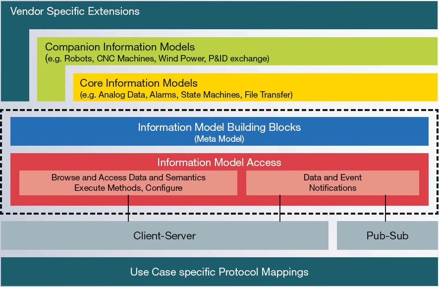

# What is OPC UA?

As the next-generation of OPC technology, OPC UA (Unified Architecture) is a major leap forward for secure, reliable and platform independent interoperability. OPC UA is designed for the transport of data and information from first-tier factory and process control devices through to the enterprise information system.

The [OPC UA specification](https://opcfoundation.org/developer-tools/specifications-unified-architecture), first released in 2008, integrates all the functionality from the existing OPC Classic specifications into a single service-oriented architecture. It adds essential new features, such as platform independence, diagnostics, discovery, rendering of complex information models, security, and reliability. Additionally, OPC UA was released as an IEC Standard, IEC 62541 in October 2011.

OPC UA provides a single set of services for the OPC data models, such as [Data Access](https://opcfoundation.org/developer-tools/specifications-unified-architecture/part-8-data-access/), [Alarms & Conditions](https://opcfoundation.org/developer-tools/specifications-unified-architecture/part-9-alarms-and-conditions/), and [Historical Access](https://opcfoundation.org/developer-tools/specifications-unified-architecture/part-11-historical-access/) and can be implemented on non-Microsoft systems, including embedded devices.

OPC UA provides services for simple / complex information models of vendors and consortia to be “plugged in” to the address space of OPC UA. This information modeling feature allows generic software applications to browse, read, write and subscribe to a whole new world of information.

# Unified Architecture

The OPC Unified Architecture (UA), released in 2008, is a platform independent service-oriented architecture that integrates all the functionality of the individual OPC Classic specifications into one extensible framework.

This multi-layered approach accomplishes the original design specification goals of:
* **Functional equivalence:** all COM OPC Classic specifications are mapped to UA
* **Platform independence:** from an embedded micro-controller to cloud-based infrastructure
* **Secure:** encryption, authentication, and auditing
* **Extensible:** ability to add new features without affecting existing applications
* **Comprehensive information modeling:** for defining complex information

## Functional Equivalence

Building on the success of OPC Classic, OPC UA was designed to enhance and surpass the capabilities of the OPC Classic specifications. OPC UA is functionally equivalent to OPC Classic, yet capable of much more:

* **Discovery:** find the availability of OPC Servers on local PCs and/or networks
* **Address space:** all data is represented hierarchically (e.g. files and folders) allowing for simple and complex structures to be discovered and utilized by OPC Clients
* **On-demand:** read and write data/information based on access-permissions
* **Subscriptions:** monitor data/information and report-by-exception when values change based on a client’s criteria
* **Events:** notify important information based on client’s criteria
* **Methods:** clients can execute programs, etc. based on methods defined on the server

Integration between OPC UA products and OPC Classic products is easily accomplished with COM/Proxy wrappers that are available in the download section.

## Platform Independence

Given the wide array of available hardware platforms and operating systems, platform independence is essential. OPC UA functions on any of the following and more:

* Hardware platforms: traditional PC hardware, cloud-based servers, PLCs, micro-controllers (ARM etc.)
* Operating Systems: Microsoft Windows, Apple OSX, Android, or any distribution of Linux, etc.

OPC UA provides the necessary infrastructure for interoperability across the enterprise, from machine-to-machine, machine-to-enterprise and everything in-between.

## Security

One of the most important considerations in choosing a technology is security. OPC UA is firewall-friendly while addressing security concerns by providing a suite of controls:

* **Transport:** numerous protocols are defined providing options such as the ultra-fast OPC-binary transport or the more universally compatible JSON over Websockets, for example
* **Session Encryption:** messages are transmitted securely at various encryption levels
* **Message Signing:** with message signing the recipient can verify the origin and integrity of received messages
* **Sequenced Packets:** exposure to message replay attacks is eliminated with sequencing
* **Authentication:** each UA client and server is identified through X509 certificates providing control over which applications and systems are permitted to connect with each other
* **User Control:** applications can require users to authenticate (login credentials, certificate, web token etc.) and can further restrict and enhance their capabilities with access rights and address-space “views”
* **Auditing:** activities by user and/or system are logged providing an access audit trail

## Extensible

The multi-layered architecture of OPC UA provides a “future proof” framework. Innovative technologies and methodologies such as new transport protocols, security algorithms, encoding standards, or application-services can be incorporated into OPC UA while maintaining backwards compatibility for existing products. UA products built today will work with the products of tomorrow.

## Information Modeling and Access

The OPC UA information modeling framework turns data into information. With complete object-oriented capabilities, even the most complex multi-level structures can be modeled and extended.

This framework is THE fundamental element of OPC Unified Architecture. It defines the rules and base building blocks necessary to expose an information model with OPC UA. While OPC UA already defines several core models that can be applied in many industries, other organizations build their models upon them, exposing their more specific information with OPC UA.

OPC UA also defines the necessary access mechanisms to information models.

* Look-up mechanism (browsing) to locate instances and their semantic
* Read and write operations for current data and historical data
* Method execution
* Notification for data and events

For Client-Server communication the full range of information model access is available via services and in doing so follows the design paradigm of service-oriented architecture (SOA), with which a service provider receives requests, processes them and sends the results back with the response.

Publish-Subscribe (PubSub), provides an alternative mechanism for data and event notification. While in Client-Server communication each notification is for a single client with guaranteed delivery, PubSub has been optimized for many-to-many configurations.

With PubSub, OPC UA applications do not directly exchange requests and responses. Instead, Publishers send messages to a Message Oriented Middleware, without knowledge of what, if any, Subscribers there may be. Similarly, Subscribers express interest in specific types of data, and process messages that contain this data, without a need to know where it originated from.

Learn how other standards organizations are leveraging OPC UA through collaborations with the OPC Foundation.