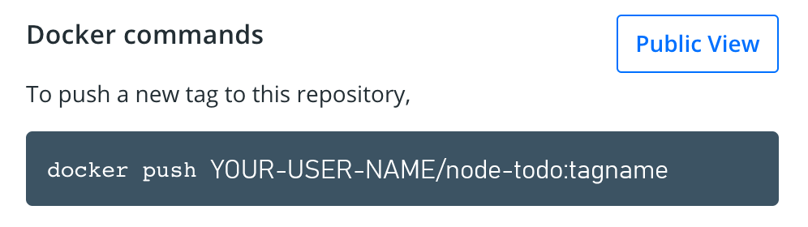

# Share the application

Now that we've built an image, let's share it! To share Docker images, you have to use a Docker
registry. The default registry is `Docker Hub` and is where all of the images we've used have come from.

> **Docker ID**

> A Docker ID allows you to access Docker Hub which is the world’s largest library and community for container images. Create a [Docker ID](https://hub.docker.com/signup) for free if you don’t have one.

## Create a Repo

To push an image, we first need to create a `repo` on `Docker Hub`.

1. [Sign up](https://www.docker.com/pricing?utm_source=docker&utm_medium=webreferral&utm_campaign=docs_driven_upgrade) or Sign in to [Docker Hub](https://hub.docker.com). 

2. Click the **Create Repository** button.

3. For the repo name, use `node-todo`. Make sure the Visibility is `Public`.

4. Click the **Create** button!

> **Private repositories**

> Did you know that Docker offers private repositories which allows you to restrict content to specific users or teams? Check out the details on the [Docker pricing](https://www.docker.com/pricing?utm_source=docker&utm_medium=webreferral&utm_campaign=docs_driven_upgrade) page.

If you look on the right-side of the page, you'll see a section named **Docker commands**. This gives
an example command that you will need to run to push to this repo.



## Pushing our Image

1.In the command line, try running the `push command` you see on Docker Hub. Note that your command will be using your **namespace** -> **YOUR-USER-NAME**.

```plaintext
$ docker push YOUR-USER-NAME/node-todo
The push refers to repository [docker.io/YOUR-USER-NAME/node-todo]
An image does not exist locally with the tag: YOUR-USER-NAME/node-todo
```

Why did it fail? The push command was looking for an image named YOUR-USER-NAME/node-todo, but didn't find one. If you run `docker image ls`, you won't see one either.
To fix this, we need to "tag" our existing image we've built to give it another name.

2.Login to the Docker Hub using the command `docker login -u YOUR-USER-NAME`.

3.Use the `docker tag` command to give the `node-todo` image a new name. Be sure to swap out `YOUR-USER-NAME` with your Docker ID.

```bash
docker tag node-todo YOUR-USER-NAME/node-todo
```

4.Now try your push command again. If you're copying the value from Docker Hub, you can drop the `tagname` portion, as we didn't add a tag to the image name. If you don't specify a tag, Docker will use a tag called `latest`.

```bash
docker push YOUR-USER-NAME/node-todo
```

## Running our Image on a New Instance

Now that our image has been built and pushed into a registry, let's try running our app on a brand new instance that has never seen this container image! To do this, we will use Play with Docker.

1. Open your browser to [Play with Docker](https://labs.play-with-docker.com/).

1. Log in with your Docker Hub account.

1. Once you're logged in, click on the "+ ADD NEW INSTANCE" link in the left side bar. (If you don't see it, make your browser a little wider.) After a few seconds, a terminal window will be opened in your browser.


1.In the terminal, start your freshly pushed app.

```bash
docker run -dp 3000:3000 YOUR-USER-NAME/node-todo
```

You should see the image get pulled down and eventually start up!

2.Click on the `3000` badge when it comes up and you should see the app with your modifications! Hooray! If the `3000` badge doesn't show up, you can click on the **"Open Port"** button and type in `3000`.

## Recap

In this section, we learned how to share our images by pushing them to a registry. We then went to a
brand new instance and were able to run the freshly pushed image. This is quite common in CI pipelines,
where the pipeline will create the image and push it to a registry and then the production environment
can use the latest version of the image.

Now that we have that figured out, let's circle back around to what we noticed at the end of the last
section. As a reminder, we noticed that when we restarted the app, we lost all of our todo list items.
That's obviously not a great user experience, so let's learn how we can persist the data across 
restarts!
